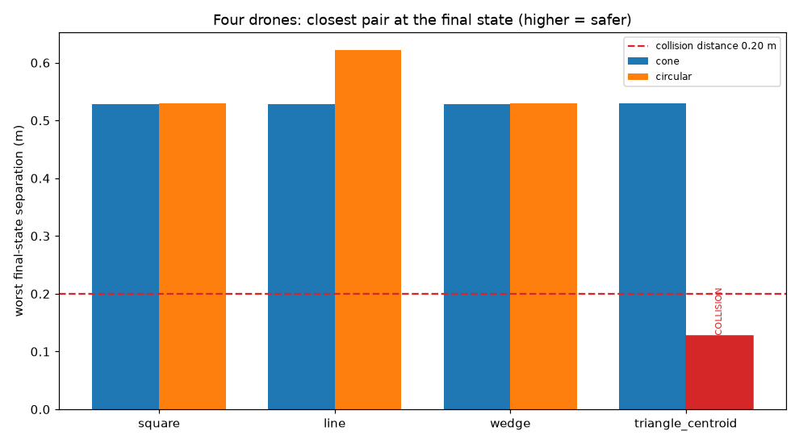

# Four identical drones: formation flight under two sensing models

Every drone runs the same gamma with the same weights and no identity, no absolute position and no shape code. Motion is non-holonomic -- gamma outputs a forward acceleration and a yaw acceleration, and a drone only ever moves along its own heading. One network per formation.

Evaluation: 5 fresh random inits per run, 300 steps (30 s) each.

## Formation error (aligned best assignment, lower = better)

| shape | cone | circular | better |
|---|---|---|---|
| square | 0.58322 | 0.58304 | circular |
| line | 0.42104 | 0.00768 | circular |
| wedge | 0.07055 | 0.59182 | cone |
| triangle_centroid | 0.68811 | 0.12350 | circular |

## Collisions (collision = centers closer than 0.20 m)

| shape | perception | min sep any step | min sep FINAL | colliding steps | verdict |
|---|---|---|---|---|---|
| square | cone | 0.529 | 0.529 | 0 | clear |
| square | circular | 0.529 | 0.529 | 0 | clear |
| line | cone | 0.529 | 0.529 | 0 | clear |
| line | circular | 0.439 | 0.622 | 0 | clear |
| wedge | cone | 0.527 | 0.528 | 0 | clear |
| wedge | circular | 0.530 | 0.530 | 0 | clear |
| triangle_centroid | cone | 0.530 | 0.530 | 0 | clear |
| triangle_centroid | circular | 0.011 | 0.128 | 344 | **COLLISION at final** |

**Final-state verdict: at least one run parks in a collision.**
**All-steps verdict: collisions occur during transit.**

## Equilibrium: does the swarm actually stop?

There is no damping term in the loss and no drag in the physics, so a swarm at rest is something gamma learned, not something it was given.

| shape | perception | residual speed (m/s) | residual yaw rate (deg/s) |
|---|---|---|---|
| square | cone | 0.0000 | 180.0 |
| square | circular | 0.0000 | 180.0 |
| line | cone | 0.0000 | 150.8 |
| line | circular | 0.1443 | 180.0 |
| wedge | cone | 0.0000 | 20.2 |
| wedge | circular | 0.0000 | 180.0 |
| triangle_centroid | cone | 0.0000 | 180.0 |
| triangle_centroid | circular | 0.5669 | 75.7 |
