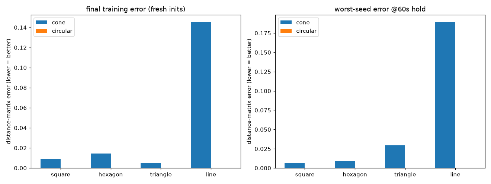

# Perception comparison: forward-FOV cone vs circular (360-degree) FOV

Both models share every hyperparameter (same seed, epochs, horizons, sensing range, N) -- the only difference is what each agent may see: a forward cone tied to its heading, or an omnidirectional disk. Generated by `make_results.py`; per-mode details live in [`cone/`](cone/summary.md), [`circular/`](circular/summary.md), with animations under `<mode>/animations/` (per-shape convergence, runtime shape switching, 60s holds).

## Setup

| | cone | circular |
|---|---|---|
| perception | cone | circular |
| half_angle_deg | 75.0 | 75.0 |
| sensing_range | 1.5 | 1.5 |
| epochs / t_min / t_max / hold_tail | 3000 / 40 / 120 / 10 | 3000 / 40 / 120 / 10 |

## Formation quality: final training error (fresh inits, lower = better)

| shape | cone | circular | winner |
|---|---|---|---|
| square | 0.0093 | 0.0001 | circular |
| hexagon | 0.0146 | 0.0001 | circular |
| triangle | 0.0049 | 0.0000 | circular |
| line | 0.1453 | 0.0001 | circular |
| **mean** | **0.0435** | **0.0001** | **circular** |

## Formation hold: worst-seed error at 10s

| shape | cone | circular |
|---|---|---|
| square | 0.0353 | 0.0005 |
| hexagon | 0.0318 | 0.0003 |
| triangle | 0.0225 | 0.0000 |
| line | 0.0808 | 0.0001 |

## Formation hold: worst-seed error at 30s

| shape | cone | circular |
|---|---|---|
| square | 0.0069 | 0.0001 |
| hexagon | 0.0104 | 0.0000 |
| triangle | 0.0041 | 0.0000 |
| line | 0.0730 | 0.0001 |

## Formation hold: worst-seed error at 60s

| shape | cone | circular |
|---|---|---|
| square | 0.0069 | 0.0001 |
| hexagon | 0.0092 | 0.0000 |
| triangle | 0.0295 | 0.0000 |
| line | 0.1892 | 0.0001 |

## Heading angular speed during the 60s holds (mean deg/s, issue #3 metric)

| shape | cone | circular |
|---|---|---|
| square | 10.8 | 122.3 |
| hexagon | 13.9 | 42.9 |
| triangle | 10.7 | 24.2 |
| line | 10.2 | 6.2 |

Read the heading columns asymmetrically: heading is *load-bearing* for the cone (it aims the sensor, so the cone model trains under that feedback and learns to keep it calm) but purely cosmetic for circular perception (adjacency ignores heading entirely), so nothing pressures the circular model's heading signal to settle.
