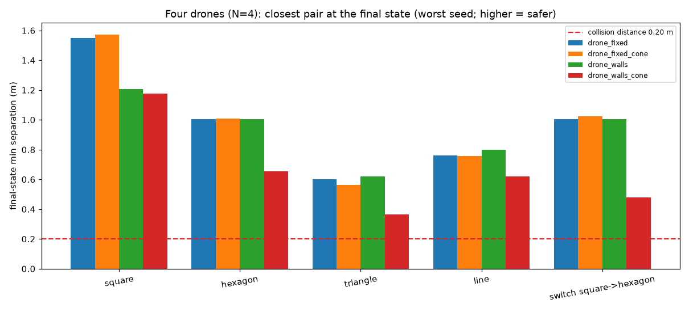

# Four-drone deployment comparison (N=4)

Every run below flies **four** drones in the 3m x 3m arena, one run per (arena method x perception model) combination, with every other hyperparameter shared. Per-run detail lives in [`drone_fixed/`](drone_fixed/summary.md), [`drone_fixed_cone/`](drone_fixed_cone/summary.md), [`drone_walls/`](drone_walls/summary.md), [`drone_walls_cone/`](drone_walls_cone/summary.md); animations are under `<mode>/animations/`.

## Setup

| | drone_fixed | drone_fixed_cone | drone_walls | drone_walls_cone |
|---|---|---|---|---|
| n | 4 | 4 | 4 | 4 |
| arena_mode | fixed | fixed | walls | walls |
| perception | circular | cone | circular | cone |
| sensing_range | 1.2 | 1.2 | 1.2 | 1.2 |
| shape_scale | 0.8 | 0.8 | 0.8 | 0.8 |
| epochs | 2000 | 2000 | 2000 | 2000 |
| drone_radius | 0.1 | 0.1 | 0.1 | 0.1 |

## Collision check -- FINAL STATE

A collision is two drone centers closer than 2 x drone_radius = 0.20m. This table is the *parked* formation at the end of each run: the state the swarm is actually left holding.

| run | square | hexagon | triangle | line | switch | verdict |
|---|---|---|---|---|---|---|
| drone_fixed | 1.549 | 1.003 | 0.599 | 0.763 | 1.003 | clear |
| drone_fixed_cone | 1.574 | 1.010 | 0.562 | 0.757 | 1.024 | clear |
| drone_walls | 1.207 | 1.003 | 0.622 | 0.798 | 1.003 | clear |
| drone_walls_cone | 1.178 | 0.653 | 0.366 | 0.621 | 0.481 | clear |

Values are the worst (smallest) final separation over the run's seeds, in meters; higher is safer.

**Verdict: no collisions at the final state in any run -- all 4 of the N=4 configurations park cleanly.**

## Collision check -- all steps (including the fly-in transient)

| run | worst separation (m) | colliding steps | runs with a collision |
|---|---|---|---|
| drone_fixed | 0.278 | 0 | 0/25 |
| drone_fixed_cone | 0.285 | 0 | 0/25 |
| drone_walls | 0.285 | 0 | 0/25 |
| drone_walls_cone | 0.332 | 0 | 0/25 |

## Formation quality -- fixed arena (fixed-target position MSE, lower = better)

| shape | drone_fixed | drone_fixed_cone | winner |
|---|---|---|---|
| square | 0.0006 | 0.0001 | drone_fixed_cone |
| hexagon | 0.0011 | 0.0003 | drone_fixed_cone |
| triangle | 0.0006 | 0.0004 | drone_fixed_cone |
| line | 0.0020 | 0.0003 | drone_fixed_cone |
| **mean** | **0.0011** | **0.0003** | **drone_fixed_cone** |

## Formation quality -- walls arena (distance-matrix error, lower = better)

| shape | drone_walls | drone_walls_cone | winner |
|---|---|---|---|
| square | 0.0931 | 0.1595 | drone_walls |
| hexagon | 0.0007 | 0.0872 | drone_walls |
| triangle | 0.0006 | 0.0545 | drone_walls |
| line | 0.0181 | 0.0536 | drone_walls |
| **mean** | **0.0281** | **0.0887** | **drone_walls** |

## Formation hold: worst-seed error at 60s

| shape | drone_fixed | drone_fixed_cone | drone_walls | drone_walls_cone |
|---|---|---|---|---|
| square | 0.0006 | 0.0001 | 0.1118 | 0.1721 |
| hexagon | 0.0011 | 0.0005 | 0.0007 | 0.0424 |
| triangle | 0.0008 | 0.0007 | 0.0007 | 0.0748 |
| line | 0.0021 | 0.0003 | 0.0008 | 0.0628 |

Hold errors are only comparable within an arena method (see above): `fixed` runs report coordinate MSE, `walls` runs the invariant distance-matrix error.
